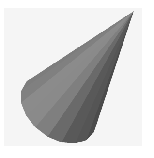
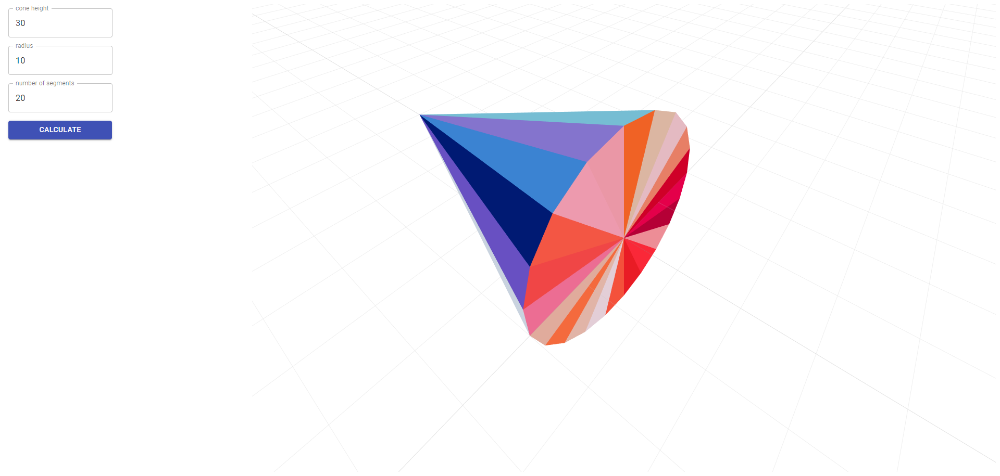

# cad-exchange-test-project

## Task
Create a simple client-server web application which can display a simple cone in a 3D view.

The application should provide the following functionality: 
1. This should be a single page application (SPA), both with front-end and back-end. 
2. The user should enter parameters (cone height, radius and number of segments on a circle) via client. 
3. The client should transfer the data to the server. 
4. The server must compute triangulation of the cone (i.e. a set of triangles to be used for display) and 
pass it back to the client.  
5. The client should display computed triangulation in a 3D view using WebGL (e.g. with the help of 
the three.js library). 
6. Make sure your implementation neither exposes memory leaks nor overutilizes CPU on repeated 
usage.

For back-end implementation we recommend using node.js (although you may choose any other alternative).

## Solution

### Project setup
npm install
### Build project
npm run build
### Launch project
npm run start

